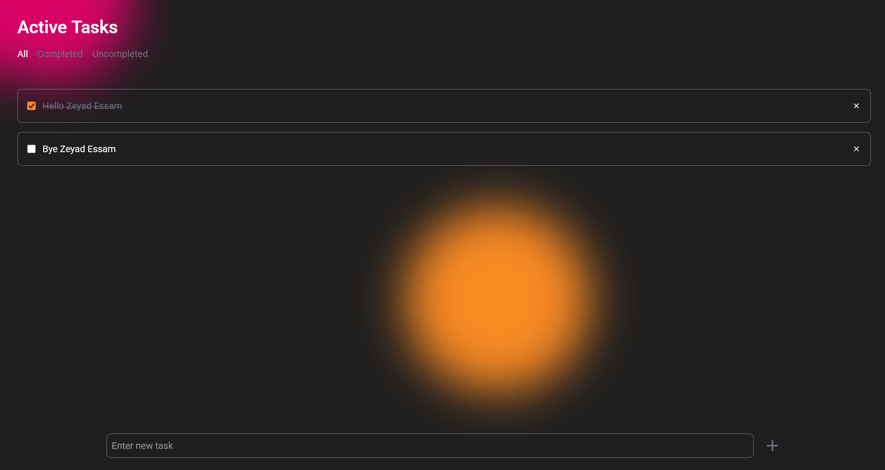

# ✔️ Minimal Todo App

_A clean and minimal TODO application built with React, TypeScript, and TailwindCSS.
The app comes with a custom random background with glass effect, smooth animations for todos, and local storage support to persist tasks._



[Live Preview](https://ah-ibrahim.github.io/Minimal-ToDo-App/)

---

## 📋 Table of Contents

- [About](#-about)
- [Tech Stack](#%EF%B8%8F-tech-stack)
- [Features](#-features)
- [Getting Started](#%EF%B8%8F-getting-started)
- [Project Structure](#project-structure)
- [License](#-license)
- [Credits](#-credits)
- [Authors](#%EF%B8%8F-authors)

---

## 👋 About

This project is a simple yet polished TODO app showcasing modern frontend practices:

- Built with React + TypeScript for robustness.

- Styled with TailwindCSS for speed and maintainability.

- Smooth animations when adding/removing todos.

- Persistent state with local storage.

- Random background generator + glassmorphism design for aesthetics.

---

## 🛠️ Tech Stack

Here’s what’s under the hood:

- **React + TypeScript** – component-based UI with static type safety

- **TailwindCSS** – utility-first CSS framework for fast styling

- **Motion** – animations and transitions

- **LocalStorage API**

---

## ✨ Features

Some cool stuff this project can do:

- ➕ Add, check, and remove todos.

- 🎨 Random background with a soft glass overlay.

- 🌀 Animated transitions for todos.

- 💾 Persistent storage — your todos stay after refresh.

- 📱 Fully responsive design.

---

## ⚙️ Getting Started

Wanna run this locally? Follow these steps:

1. Clone the repo

```bash
git clone https://github.com/Ah-Ibrahim/Minimal-ToDo-App.git
cd your-repo
```

2. Install dependencies

```bash
npm install
```

3. Start the app

```bash
npm run dev
```

---

## Project Structure

```
marketing-landing-page/
├── public/              # Static assets
├── src/
|   ├─ assets/           # Components assets
│   ├── components/      # UI components (presentation only)
│   ├── utils/           # Utility functions
│   ├── types/           # Zod schemas for validation
│   ├── pages/           # Page-level components
│   ├── hooks/           # Custom hooks
│   └── main.tsx         # App entry point
├── tailwind.config.js   # Tailwind config
├── tsconfig.json        # TypeScript config
└── package.json
```

---

## 📄 License

This project is licensed under the MIT License.
Feel free to do what you want with it.

---

## 🙏 Credits

Big thanks to:

- Icons from [Remix](https://remixicon.com/)

---

## ✍️ Authors

Ahmed Ibrahim
